# Vault Book

**A private, self-hosted personal finance tracker that runs entirely on your own computer.**

Import your bank and credit card statements and Vault Book will break out every transaction by month and week, show how much you owe on each card, find recurring charges you might want to cancel (you cancel them yourself; Vault Book only helps you plan), help you build a needs-vs-wants budget, and lay out a plan to pay your credit cards down to $0.


-lightgrey)

> [!IMPORTANT]
> **Provided as-is, with no support.** This is a personal project shared in case it's useful to others. Issues and pull requests may not be answered. See [Disclaimer](#disclaimer).

> [!NOTE]
> Built with the assistance of [Claude](https://www.anthropic.com/claude), Anthropic's AI assistant.

---

## Contents

- [Features](#features)
- [Screenshots](#screenshots)
- [Requirements](#requirements)
- [Quick start](#quick-start)
- [Using Vault Book](#using-vault-book)
- [Security & privacy](#security--privacy)
- [Household mode & home-network access](#household-mode--home-network-access)
- [Supported statement formats](#supported-statement-formats)
- [Development](#development)
- [Project structure](#project-structure)
- [Backup & restore](#backup--restore)
- [Troubleshooting](#troubleshooting)
- [Disclaimer](#disclaimer)
- [License](#license)

---

## Features

| Area | What it does |
|---|---|
| **Statement import** | CSV, OFX/QFX, PDF, and **photos or scanned statements via OCR** (read in your browser, on your computer). Columns are auto-detected, rows are previewed before saving, duplicates are skipped, and any import can be undone. Vault Book works out each statement's period on its own: the preview says which months it covers, adds, fills or overlaps, and a *Statement coverage* timeline shows each account's months, gaps and what to import next. Credit card PDFs also fill in balance, minimum payment, APR, credit limit, and due date. |
| **Transactions** | Search and filter by account or category. View one **day**, **week**, or **month** at a time, or **all** transactions, with money-in and money-out totals. Months are worked out from your data: chips show each month that has transactions (with counts), the view opens on your latest activity, and the arrows skip straight to the previous or next period with transactions. Re-categorize a transaction and Vault Book can remember the merchant for next time. |
| **Accounts** | Checking, savings, money market, CDs, cash, investments (brokerage, retirement), property & assets (home, vehicles, other property, with expected yearly change and equity against a linked mortgage or car loan), credit cards, and loans (auto, mortgage, student, personal, medical, other). Shows totals and net worth. Enter a savings APY and Vault Book estimates interest per month and year, the balance including interest to date, and a CD's value at maturity. |
| **Dashboard** | A full overview: net worth (bank, investments and property minus cards and loans, with a breakdown), debt-free date, monthly spending and income, budget status, recurring charges and bills due in the next 2 weeks, savings interest, 12-month income vs. spending, weekly needs vs. wants, top categories, debts, and recent activity. |
| **Recurring charges** | Finds subscriptions and bills that repeat weekly, monthly, quarterly, or yearly. Shows yearly cost, flags price increases, and lets you mark each one *Plan to cancel* or *Keep*. Pick the month you expect each one to stop and see your planned savings month by month. Switch to *By month* to see which recurring charges were billed in any month and their total. **Planning only: Vault Book never cancels anything.** |
| **Budget** | Monthly budgets per category, each marked **Need** or **Want**. One click suggests amounts from your 3-month averages, and spending is compared with the 50/30/20 guideline. Set a usual expected income in Settings, and a different amount for any month (e.g. a bonus month). Months are worked out from your spending (chips with each month's total); the current month is marked in progress with a projection of where it's heading. |
| **Debt payoff plan** | **Avalanche** (highest APR first) vs. **Snowball** (smallest balance first). Shows your debt-free date, total interest, interest saved vs. paying only minimums, a month-by-month payment schedule (jump by plan year, with debts paid off each year, and click any month to see exactly what to pay on each debt), and "speed it up" scenarios. |
| **Payoff theory** | A sandbox under *Debt payoff plan* for "what if" ideas: add **bonuses** (one-time or repeating monthly, quarterly, twice a year or yearly, with the % you’ll put toward debt), **raises** starting any month (e.g. a mid-year promotion), one-time **lump sums**, **monthly increases**, and **investment withdrawals** (after the account’s tax & penalties), each aimed at a specific debt or the focus debt. An *Investment impact* view weighs the interest saved against the investment growth given up, change the monthly payment or strategy, and compare against your main plan: debt-free date, interest saved, per-card payoff dates and a month-by-month schedule. Keep as many theories as you like, side by side as tabs. Each one saves automatically to your encrypted vault as you edit, and can be renamed, duplicated, reset or deleted. **Apply** the best one to your main plan. **Planning only: Vault Book never makes payments.** |
| **Household mode** | Optional (off by default) multi-user mode for families: each member has their own vault, encrypted with their own password. Optional home-network access (also off by default). |
| **Months, worked out for you** | No month pickers: every page works out its months from your data and shows them as chips with a total or count (spending, activity, recurring bills, plan years), opening on the current month if it has activity, otherwise your latest. |
| **Appearance** | Modern responsive UI with Light, Dark, and Auto (follows your OS) themes. |

## Screenshots

All screenshots use the fictional demo data (see [Try it with demo data](#try-it-with-demo-data)).

### Dashboard
Net worth (what you have vs. what you owe), monthly spending and income, debt-free date, budget status, upcoming bills, charts, debts, and recent activity.

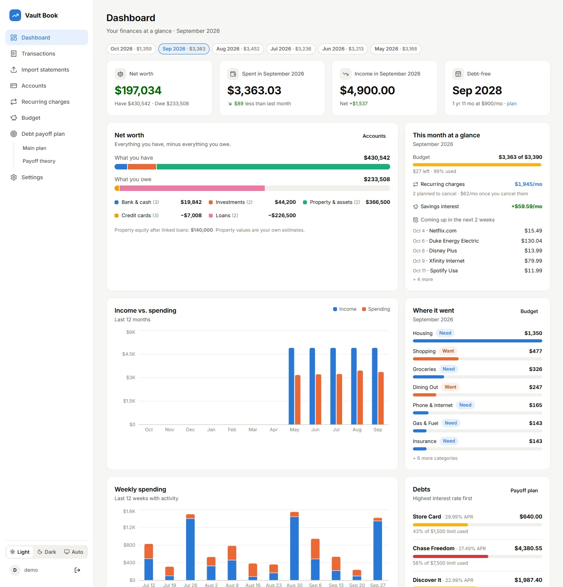

### Transactions
View by day, week, or month. Months are worked out from your data and shown as chips. Re-categorize anything inline.

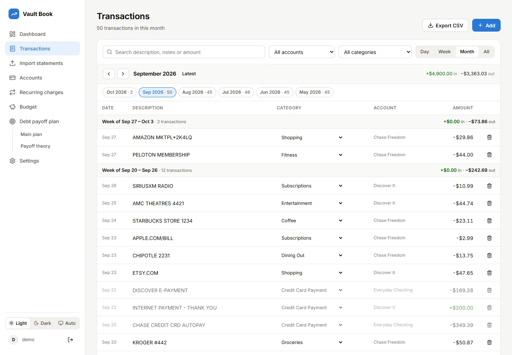

### Import statements
CSV, OFX/QFX, PDF, or a photo/scan (OCR). The coverage timeline shows each account's months, gaps, and what to import next.

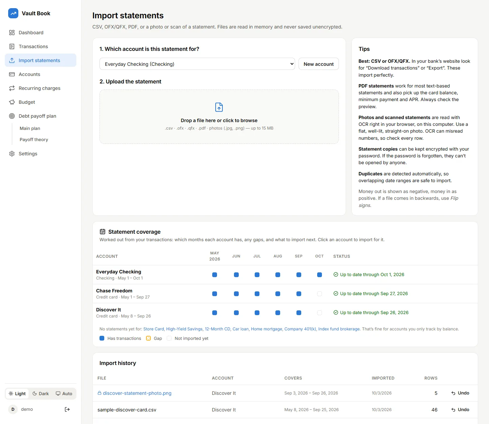

### Accounts
Bank & cash, investments, property & assets (with equity against linked loans), credit cards, and loans, plus account activity by month.

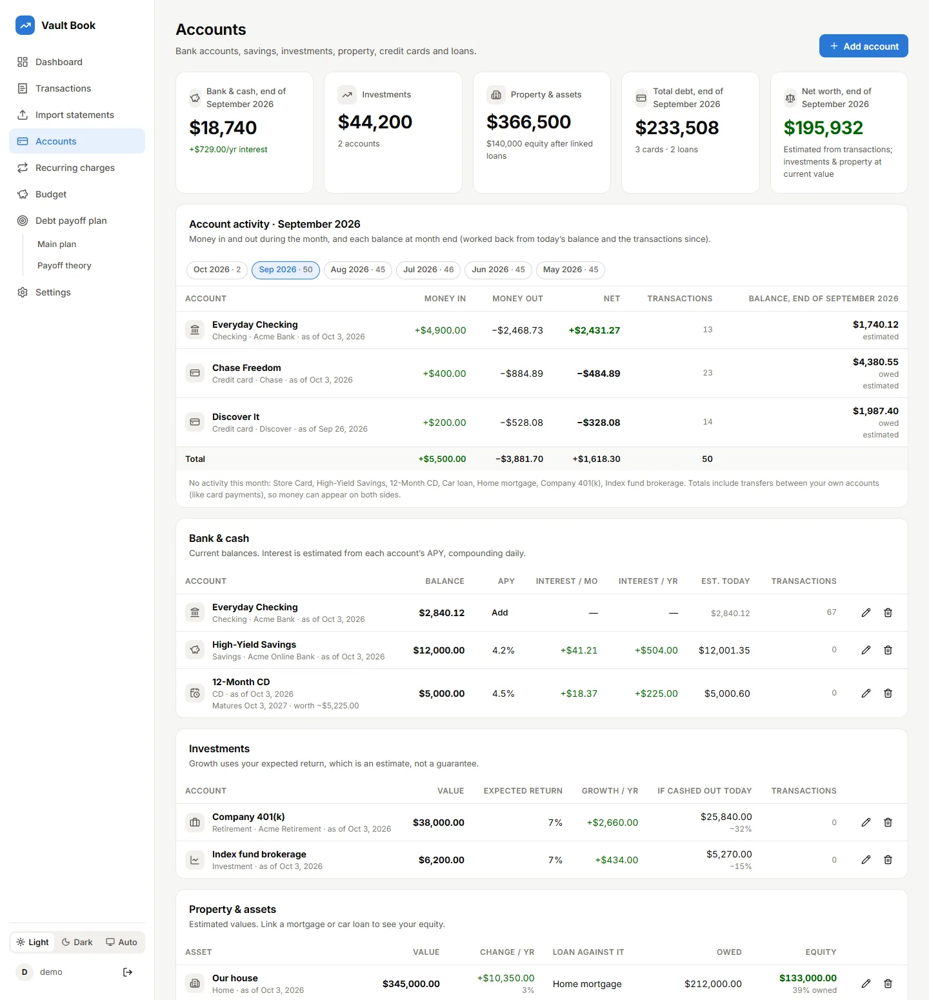

### Recurring charges
Subscriptions and bills found automatically. Plan which to cancel (you cancel them yourself) and see the savings month by month.

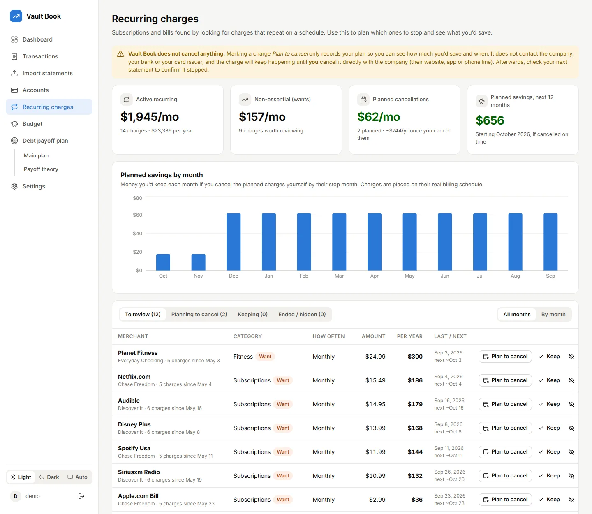

### Budget
Monthly budgets by category (needs vs. wants), progress bars, 3-month averages, and the 50/30/20 check.

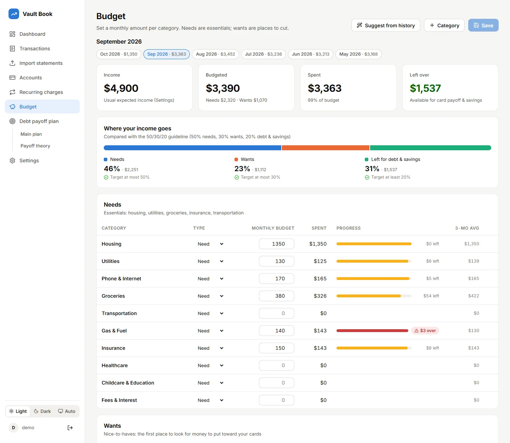

### Debt payoff plan
Avalanche or snowball, debt-free date, interest saved, balance charts, payoff order, and "speed it up" ideas.

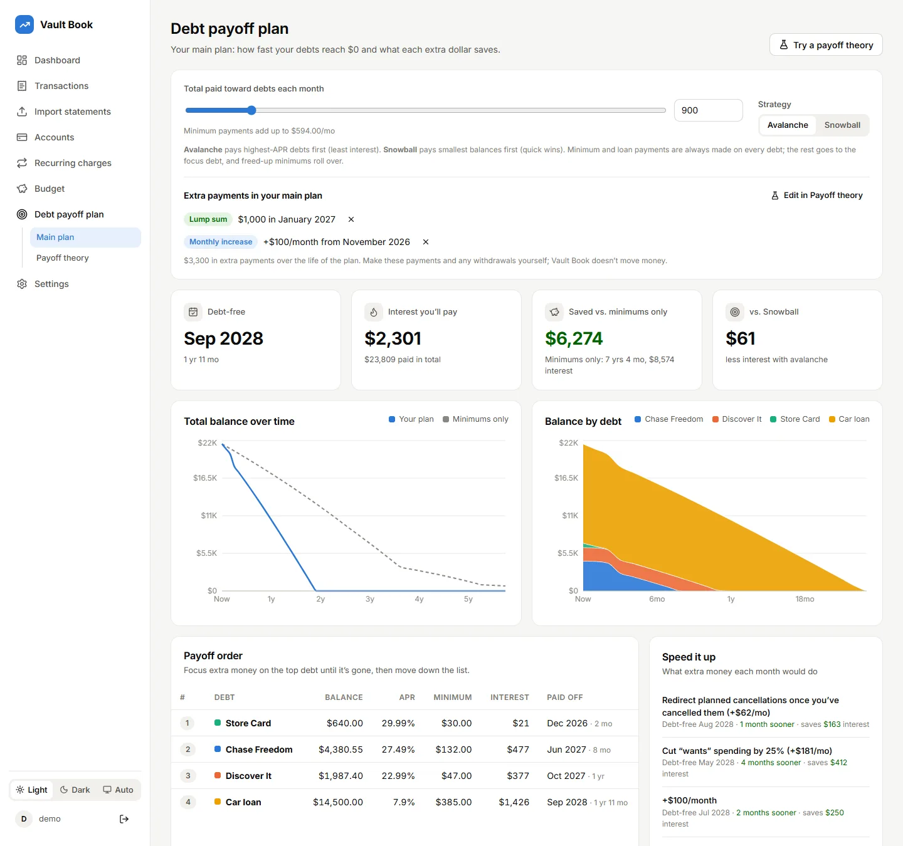

### Payoff theory
Try what-ifs (bonuses, raises, lump sums, investment withdrawals) as autosaved theories, compare with your main plan, and apply the best one.

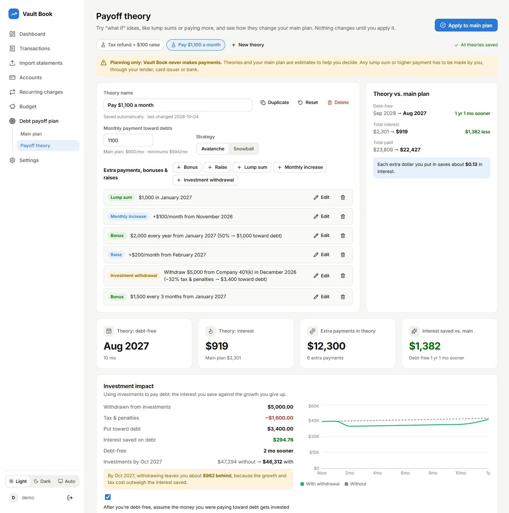

### Settings
Security, appearance, monthly expected income, encrypted backup, household mode, and categorization rules.

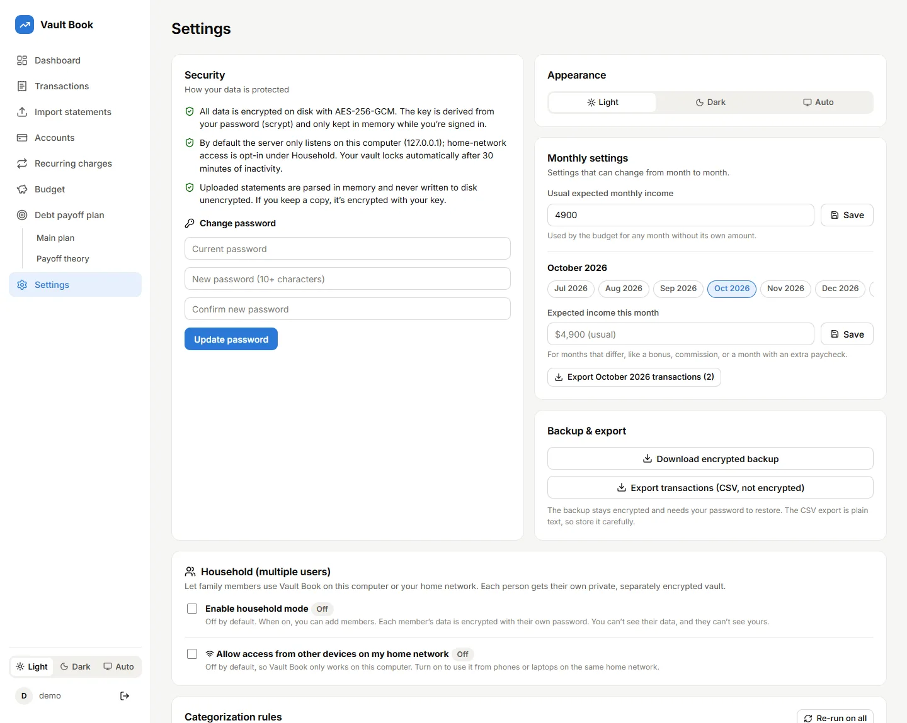

### Dark mode

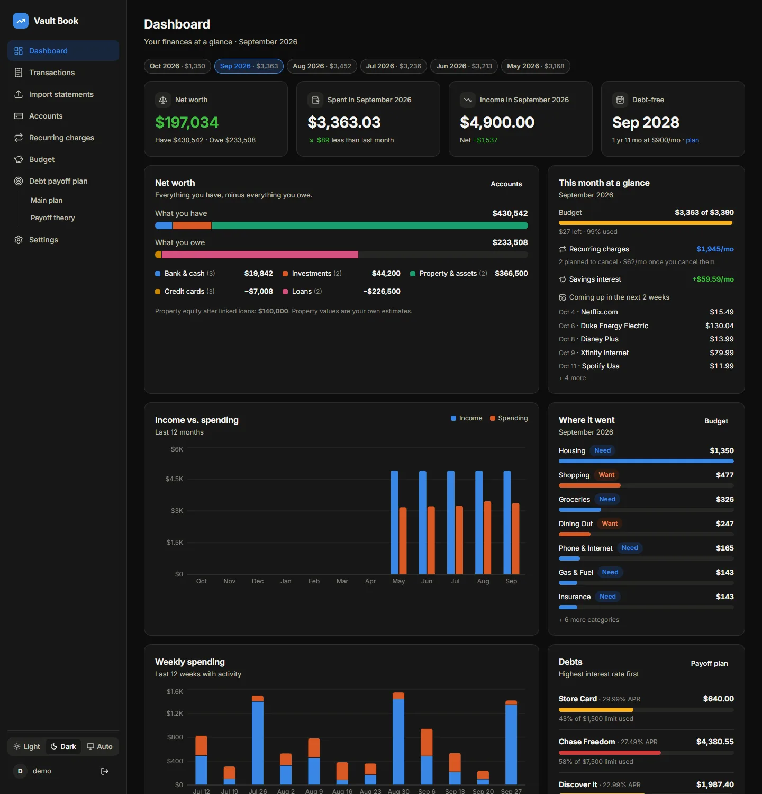 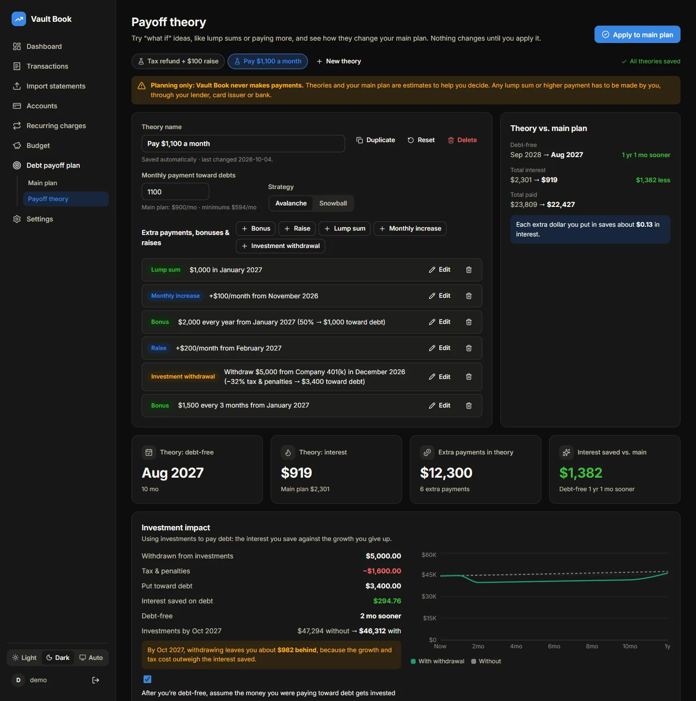

### Sign in

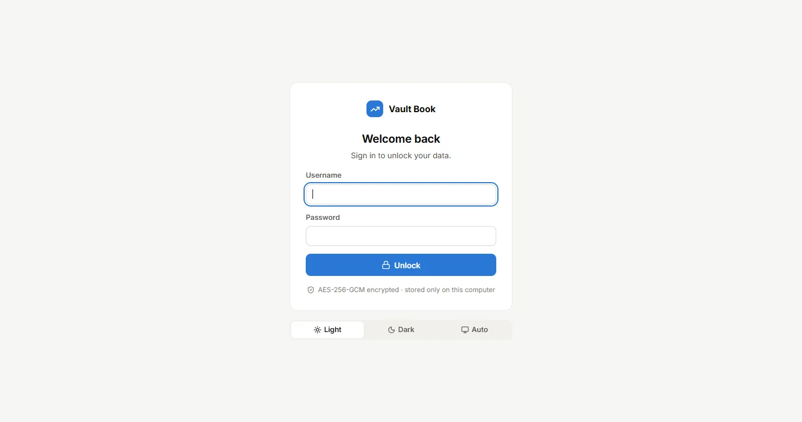

> To refresh these after changes, run the demo (`npm run dev:demo`) and then `npm run screenshots`.

## Requirements

- [Node.js](https://nodejs.org/) **22.13 or newer** (includes npm)
- A modern browser (Chrome, Edge, Firefox, or Safari)
- Windows, macOS, or Linux

## Quick start

```bash
git clone https://github.com/ranger64511/vaultbook.git
cd vaultbook
npm install
npm run build
npm start
```

Then open **http://localhost:4310**.

On Windows you can instead double-click **`Start Vault Book.bat`**, which installs, builds, starts, and opens the app.

On first launch you'll create a username and password.

> [!WARNING]
> **There is no password reset.** Your password is the key that decrypts your data. If you lose it, your data cannot be recovered. Keep it in a password manager and download a backup regularly.

## Using Vault Book

1. **Add your accounts.** Go to *Accounts & cards* and add each checking, savings, money market, CD, cash, investment, credit card, and loan account. For savings-type accounts, add the APY to see the interest you earn. For cards and loans, include the APR and minimum or monthly payment so the payoff plan is accurate. Untick “Include in the debt payoff plan” for debts you just want to pay normally (like a mortgage).
2. **Import statements.** Go to *Import statements*, pick the account, and drop in a file. Review the preview, then click **Import**. Importing 2–3 months or more makes recurring-charge detection work well.
3. **Clean up categories.** Fix any miscategorized transactions on the *Transactions* page. Vault Book offers to remember the merchant.
4. **Review recurring charges.** Mark subscriptions you want to drop as *Plan to cancel* and choose when you expect to stop them. Vault Book shows how much you’d save each month. Then **cancel each one yourself** directly with the company. Vault Book does not contact merchants, banks, or card issuers.
5. **Set a budget.** On *Budget*, click **Suggest from history**, adjust, and **Save**. Use **+ Category** to add your own categories.
6. **Plan your payoff.** On *Debt payoff plan → Main plan*, set how much you can put toward cards each month and compare strategies.
7. **Try payoff theories.** On *Debt payoff plan → Payoff theory*, test lump sums and payment increases, save the ones you like, and apply the best to your main plan. Then make those payments yourself.

### Try it with demo data

To explore Vault Book without your own statements, run the sandbox. It stores data separately in `data-demo/`.

```bash
npm run dev:demo
```

In a second terminal, load the fake sample statements:

```bash
node samples/seed-demo.js
```

Open **http://localhost:5173** and sign in with the demo login in [`samples/DEMO_LOGIN.md`](samples/DEMO_LOGIN.md).

## Security & privacy

Vault Book is designed so that your financial data never leaves your computer and is never stored unencrypted.

| Protection | Details |
|---|---|
| **Encryption at rest** | All data lives in one file, `data/vault.enc`, encrypted with **AES-256-GCM**. |
| **Password-derived key** | A random data key is wrapped with a key derived from your password using **scrypt** (N=2¹⁷, r=8, p=1). Only the wrapped key is stored, in `data/auth.json`. |
| **Key only in memory** | The decrypted key exists only in server memory while you're signed in. It's wiped on sign-out, after 30 minutes idle, or after 12 hours at most. |
| **Local only (by default)** | The server binds to `127.0.0.1`, so it's unreachable from other devices unless the admin turns on home-network access. Requests addressed to unknown host names are always rejected (DNS-rebinding protection). |
| **Separate vaults per person** | In household mode every member has their own data key, wrapped with their own password. No one, including the admin, can open another member's vault. |
| **Uploads** | Statements are parsed in memory. OCR runs in your browser. Nothing is written to disk unencrypted. |
| **Statement copies** | Optionally keep the original file of each import, encrypted (AES-256-GCM) with your vault key in `data/files/`. Only your password can open them; if it's forgotten, they're unrecoverable. Undoing an import deletes its copy. |
| **Web hardening** | httpOnly + SameSite=Strict session cookies, a CSRF header on every change, login lockout after repeated failures, and a strict Content-Security-Policy (via [helmet](https://helmetjs.github.io/)). |

See [SECURITY.md](SECURITY.md) for the threat model and its limits.

> [!CAUTION]
> Never commit the `data/` folder or a backup file. Both are excluded in `.gitignore` by default.

## Household mode & home-network access

Both are **off by default**. Vault Book starts as a single-user app that only works on the computer it runs on.

**Household mode** (Settings → Household, admin only):

1. Turn on **Enable household mode**.
2. Click **Add member** and set a username and starting password for each person. Share the password in person; they can change it in Settings.
3. Each member signs in on the same login screen and gets their **own private vault**, encrypted with **their own password**. The admin can add and remove members but **cannot see anyone else's data**.
4. Passwords can't be reset by anyone. If a member forgets theirs, remove them and add them again (their old data is lost).

Turning household mode off signs other members out. Their data is kept until you turn it back on or remove them.

**Home-network access** (Settings → Household → *Allow access from other devices on my home network*):

1. Turn it on, then **restart Vault Book**.
2. Settings shows the addresses to open on a phone or laptop on the same network, such as `http://192.168.1.20:4310`.
3. Your firewall may ask about Vault Book. Allow **private networks only**.
4. Only use this on a network you trust, never on public Wi-Fi.

> [!WARNING]
> Over plain HTTP, traffic between devices on your network isn't encrypted (your stored data still is). For better protection, run Vault Book with HTTPS:
> 1. Create a certificate for your computer's address, for example with [mkcert](https://github.com/FiloSottile/mkcert): `mkcert 192.168.1.20 my-pc.local`
> 2. Start Vault Book with `VAULTBOOK_TLS_CERT` and `VAULTBOOK_TLS_KEY` pointing to the two files.
> 3. Install mkcert's root certificate on each device that will connect.

## Supported statement formats

| Format | Reliability | Notes |
|---|---|---|
| **CSV** | ★★★ | Column auto-detection handles most banks: single amount column, separate debit/credit columns, and files with header rows on top. |
| **OFX / QFX / QBO** | ★★★ | The "Quicken" or "Money" download most banks offer. Very consistent. |
| **PDF** | ★★☆ | Best effort for text-based statements. Always check the preview. |
| **Photos & scanned PDFs (OCR)** | ★☆☆ | Read with OCR (Tesseract) right in your browser; the engine and English data are served locally, nothing goes online. Use flat, well-lit, straight-on photos and check every row. |

**Where to find these files:** in your bank's website, open an account's activity page and look for **Download** or **Export transactions**.

**Signs:** Vault Book shows money out as negative and money in as positive. Card exports that list charges as positive are detected and flipped automatically. If a file still comes in backwards, use **Flip signs** in the preview.

## Development

```bash
npm install
npm run dev        # API + Vite dev server with hot reload → http://localhost:5173 (or the next free port)
npm test           # unit tests (parsers, categorization, recurring detection, payoff math)
npm run build      # production build → client/dist
npm start          # serve the built app → http://localhost:4310
```

| Script | Purpose |
|---|---|
| `npm run dev` | Development mode using your real `data/` vault |
| `npm run dev:demo` | Development mode using the separate `data-demo/` sandbox |
| `npm run samples` | Regenerate the fake sample CSV files |
| `npm test` | Run the test suite with Node's built-in test runner |
| `npm run screenshots` | Regenerate the README screenshots from the running demo (uses an installed Edge or Chrome) |

**Environment variables (optional):**

| Variable | Default | Purpose |
|---|---|---|
| `VAULTBOOK_PORT` | `4310` | API / app port |
| `VAULTBOOK_DATA_DIR` | `./data` | Where the encrypted vaults are stored |
| `VAULTBOOK_HOST` | `127.0.0.1` | Address to listen on (overrides the home-network setting) |
| `VAULTBOOK_ALLOWED_HOSTS` | | Extra host names allowed to reach the app, comma-separated |
| `VAULTBOOK_TLS_CERT` / `VAULTBOOK_TLS_KEY` | | Certificate and key files to serve over HTTPS |

**Tech stack:** React 19, React Router, Recharts, Lucide icons, Vite · Node.js, Express 5, helmet, multer, PapaParse, pdf.js.

## Project structure

```
├── client/                 React front end (Vite root)
│   ├── public/             Static assets (favicon, theme bootstrap script)
│   └── src/
│       ├── pages/          Dashboard, Transactions, Import, Accounts, Recurring, Budget, Payoff, Settings
│       ├── components/     Shared UI (cards, modal, charts, theme toggle)
│       └── lib/            Formatting, theming, analytics (recurring detection + payoff simulation)
├── server/
│   ├── index.js            Express API, sessions, security middleware
│   ├── vault.js            Encryption: scrypt key derivation, AES-256-GCM vault
│   ├── categorize.js       Default categories, keyword rules, merchant normalization
│   └── parsers/            CSV, OFX/QFX, and PDF statement parsers
├── samples/                Fake sample statements and demo seed script
├── data/                   Your encrypted vaults (git-ignored): users.json, vaults/, files/
└── Start Vault Book.bat        One-click launcher for Windows
```

## Backup & restore

- **Encrypted backup:** *Settings → Download encrypted backup*. This gives you a JSON file containing your encrypted vault and wrapped key. You still need your password to use it.
- **Restore:** stop Vault Book. Put the backup's `auth` record (with your user id and role) into `data/users.json`, base64-decode `vault` into `data/vaults/<your user id>.enc`, and each entry in `files` into `data/files/<your user id>/<id>.enc`. Then start Vault Book and sign in.
- **CSV export:** *Transactions → Export CSV*. This file is **not encrypted**, so store it carefully.

## Troubleshooting

| Problem | Fix |
|---|---|
| "Could not find date / description / amount columns" | The CSV layout isn't recognized. Try your bank's OFX/QFX download instead. |
| PDF shows "no readable text" | It's a scanned image. Download a CSV or OFX export instead. |
| Amounts are backwards | Click **Flip signs** in the import preview, or flip a single row by clicking its amount. |
| Signed out unexpectedly | Vault Book locks after 30 minutes idle and whenever the server restarts. Sign in again. |
| Port already in use | Start with another port, e.g. `VAULTBOOK_PORT=4400 npm start`. |
| Forgot password | Not recoverable by design. Delete `data/` to start over. **This erases all data.** |

## Disclaimer

- This software is provided **"as is", without warranty of any kind**, and **without support**. Use it at your own risk.
- **Vault Book never takes action on your accounts.** It does not cancel subscriptions, make payments, move money, or contact any bank, card issuer, or merchant. Features like *Plan to cancel* and the debt payoff plan are planning aids only. You are responsible for carrying out any changes yourself.
- Vault Book is a personal budgeting and planning tool. It is **not financial, tax, or legal advice**. Payoff projections are estimates that assume no new charges, fixed APRs, and fixed minimum payments.
- Vault Book is not affiliated with any bank or card issuer. Bank and merchant names appear only in categorization rules and fictional sample data.
- Built with the assistance of Claude (Anthropic). Review the code yourself before trusting it with sensitive data.

## License

Released under the [MIT License](LICENSE).
